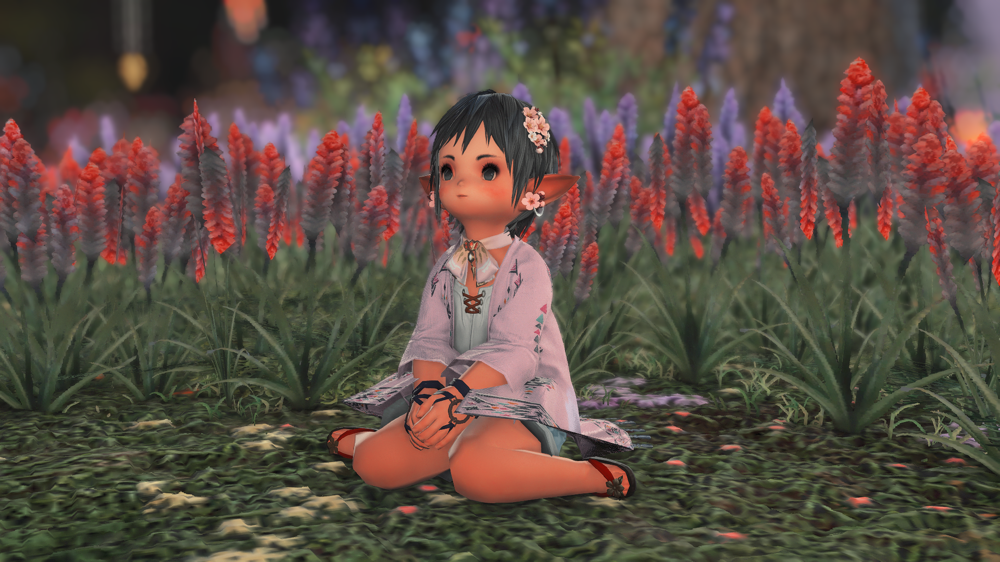
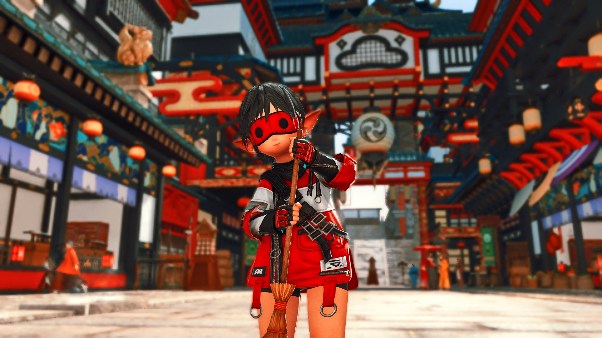

# What is this?

This is my own set of reshade shaders and presets for FFXIV which should hopefully not conflict with other presets.

Let me know if anything is missing.

# Installation

First, download the latest release zip file [here](https://github.com/momohoudai/momo_reshade/releases/latest).

Then, just overwrite the existing `reshade_presets` and `reshade_shaders` folder in your FFXIV reshade installation folder.

The files in the zip are all prefixed with `momo_` so it should just work UNLESS you have a shader or texture that is also prefixed with `momo_`

# Presets

Here are some screenshots of the presets and a brief explanation of them.

## momo_gameplay

This is my main gameplay shader. It is basically a modified Ipsusu's pastel gameplay shader which looks nice for playing the game and is optimized for performance.

Credits to [Ipsusu](https://github.com/ipsusu/)

## momo_wifi_ciel

This is a modified version of [Wifi's](https://potatoworshiper.wixsite.com/jagaimo-no-sekai/wifi-presets) Ciel shader. 
It is best used outdoors. 
It *can* be a little too bright so you might need to adjust with the in-game gpose "Manual Brightness Adjustment" slider.

Remember to add `#wifipresets` when posting on social media using this shader!

## momo_lala_normie

This is my own shader that supposedly looks nice a Lalafell skin.
I mostly default to this one and play around with in-game settings to add colors via lighting.

## momo_lala_cool

This is my own shader that enhances cooler tones, particularly blue. 
Looks very nice near aetherytes and gloomy places like Ishgard.

## momo_lala_warm

This is my own generic shader for enhancing warmer colors, particularly red.
In general, this looks nice especially in Shirogane areas.

